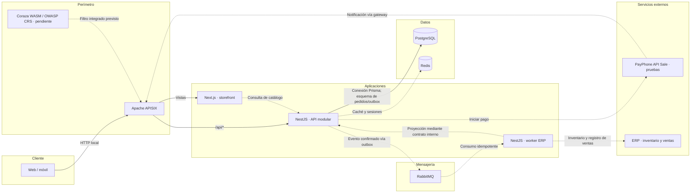
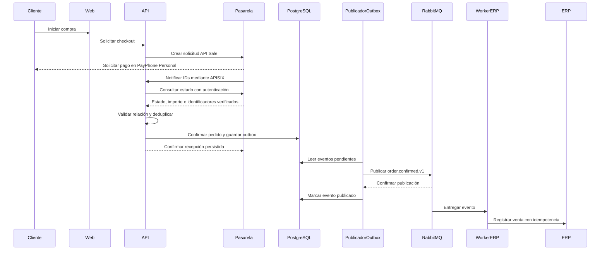

# GroupMG Commerce

**Base de comercio electrónico de GroupMG · TESSIUM Tech**

Monorepo TypeScript con storefront Next.js, API modular NestJS e integración ERP
asíncrona. Este repositorio define la estructura inicial de desarrollo, los límites
entre componentes y la infraestructura local.

> **Estado: scaffold + persistencia DEMO-02.** La API conecta PostgreSQL; hay migraciones y seed. La web tiene vistas
> iniciales. El catálogo real, la autenticación, los pedidos, los pagos y la
> sincronización ERP todavía no están implementados.

[Arquitectura detallada](docs/architecture.md) · [Guía de desarrollo](docs/development.md) · [Roadmap](docs/roadmap.md) · [Reglas de la demo](docs/demo-rules.md)

## Arquitectura

Las líneas continuas representan rutas configuradas en el gateway. Las líneas
punteadas muestran integraciones previstas, aún sin implementar. PostgreSQL ya está conectado a la API; las demás integraciones siguen pendientes.



La API es dueña de las reglas de pedidos y pagos. Next.js se ocupa de la
experiencia web. El worker aísla los formatos y fallos del ERP mediante una capa
anticorrupción. Coraza se integrará como filtro WASM de APISIX; no está activo en
este init.

### Flujo objetivo de una compra

Este diagrama describe el comportamiento que se implementará. El paso
**pedido + outbox** debe ser una sola transacción. El publicador outbox forma
parte del diseño backend y todavía no existe en el código.



La entrega será **al menos una vez**: un evento puede repetirse y el consumidor
debe deduplicarlo. Un fallo del ERP no deshace un pago confirmado. Reintentos,
cola de errores y reconciliación están descritos en la [arquitectura](docs/architecture.md).

## Stack y estado actual

| Área         | Tecnología                | Incluido en el init                                         |
| ------------ | ------------------------- | ----------------------------------------------------------- |
| Monorepo     | pnpm 12.5.1 / TypeScript  | Workspaces, lockfile y configuración común                  |
| Web          | Next.js 16 / React 19     | Inicio, catálogo y checkout con estados vacíos              |
| Backend      | NestJS 11                 | Módulos vacíos de catálogo, auth, pedidos y pagos; liveness |
| Worker       | NestJS 11                 | Arranque independiente y puerto tipado para ERP             |
| Contratos    | TypeScript                | Propuesta de evento `order.confirmed.v1`                    |
| Gateway      | Apache APISIX             | Rutas web/API en modo standalone                            |
| Persistencia | PostgreSQL 17             | Prisma, migraciones, seed y volumen persistente             |
| Caché        | Redis 7.4                 | Contenedor con volumen; sin cliente de aplicación           |
| Mensajería   | RabbitMQ 4.1              | Broker y consola; sin exchanges ni consumidores propios     |
| WAF          | Coraza / OWASP CRS        | Plan de integración, pendiente de habilitar                 |
| Calidad      | GitHub Actions / Prettier | Formato, tipos, build, Compose y pruebas PostgreSQL         |

## Estructura del repositorio

```text
groupmg-commerce/
├── apps/
│   ├── web/                    # Páginas y experiencia de compra
│   ├── api/                    # Reglas de negocio y endpoints HTTP
│   └── worker-erp/             # Integración asíncrona y puerto ERP
├── packages/
│   └── contracts/              # Contratos compartidos y eventos versionados
├── infra/
│   ├── docker/                 # Dockerfile común por workspace
│   ├── apisix/                 # Configuración del gateway y rutas
│   └── coraza/                 # Plan de integración WAF
├── docs/
│   ├── architecture.md         # Decisiones, datos, flujos y límites
│   ├── development.md          # Guía operativa local
│   └── roadmap.md              # Etapas y criterios de aceptación
├── .github/workflows/ci.yml    # Validaciones automatizadas
├── .env.example               # Variables locales para Compose
├── compose.yaml               # Infraestructura y perfil de aplicaciones
├── pnpm-workspace.yaml        # Aplicaciones y paquetes del monorepo
└── pnpm-lock.yaml             # Resolución reproducible de dependencias
```

## Inicio rápido

### Requisitos

- **Node.js 24**, según `.nvmrc` y `engines`.
- **pnpm 12.5.1**, fijado en `packageManager`.
- **Docker con Compose v2** para levantar infraestructura o el entorno completo.
- Acceso al repositorio de la organización.

Con Node 24 y Corepack disponible, habilitar pnpm una sola vez:

```sh
corepack enable
corepack prepare pnpm@12.5.1 --activate
```

### Desarrollo local

```sh
git clone git@github.com:TESSIUM-Tech/groupmg-commerce.git
cd groupmg-commerce
pnpm install --frozen-lockfile
pnpm build
pnpm dev:web
```

Abrir [localhost:3000](http://localhost:3000). El frontend tiene recarga automática.
No requiere base de datos para mostrar las vistas iniciales.

Para ejecutar la API compilada en otra terminal:

```sh
pnpm --filter @groupmg/api start
```

La ruta [localhost:3001/api/v1/health](http://localhost:3001/api/v1/health)
verifica que el proceso está vivo.

### Backend con recarga

Después del primer `pnpm build`, usar dos terminales por servicio:

| Servicio   | Terminal de compilación | Terminal de ejecución                       |
| ---------- | ----------------------- | ------------------------------------------- |
| API        | `pnpm dev:api`          | `node --watch apps/api/dist/main.js`        |
| Worker ERP | `pnpm dev:worker`       | `node --watch apps/worker-erp/dist/main.js` |

Los scripts `dev:api` y `dev:worker` **solo recompilan**. El segundo comando
reinicia el proceso al cambiar los archivos compilados. El worker permanece
activo, pero aún no consume mensajes ni ejecuta tareas programadas.

### Infraestructura local

Copiar `.env.example` a `.env` una sola vez. En PowerShell:

```powershell
Copy-Item .env.example .env
```

En macOS/Linux:

```sh
cp .env.example .env
```

Con Docker en ejecución:

```sh
pnpm infra:up
```

Esto inicia PostgreSQL, Redis y RabbitMQ. Las credenciales del ejemplo son
exclusivamente locales. `.env` está excluido de Git.

### Todo con Docker

Con `.env` preparado:

```sh
docker compose --profile app up --build -d
```

Abrir [localhost:8080](http://localhost:8080). APISIX dirige el tráfico a web y API.
En esta modalidad no hay recarga del código: después de cambiar archivos,
reconstruir el servicio correspondiente, por ejemplo:

```sh
docker compose --profile app up --build -d web
```

El Dockerfile instala y compila con pnpm; el contenedor final ejecuta Node como
usuario no root y no necesita descargar pnpm al arrancar.

## Accesos locales

| Recurso             | Ejecución local                                                     | Ejecución con Docker                                                |
| ------------------- | ------------------------------------------------------------------- | ------------------------------------------------------------------- |
| Web                 | [localhost:3000](http://localhost:3000)                             | [localhost:8080](http://localhost:8080)                             |
| Liveness web        | [localhost:3000/health](http://localhost:3000/health)               | [localhost:8080/health](http://localhost:8080/health)               |
| Liveness API        | [localhost:3001/api/v1/health](http://localhost:3001/api/v1/health) | [localhost:8080/api/v1/health](http://localhost:8080/api/v1/health) |
| PostgreSQL          | Requiere infraestructura                                            | `127.0.0.1:5432`                                                    |
| Redis               | Requiere infraestructura                                            | `127.0.0.1:6379`                                                    |
| RabbitMQ AMQP       | Requiere infraestructura                                            | `127.0.0.1:5672`                                                    |
| RabbitMQ Management | Requiere infraestructura                                            | [localhost:15672](http://localhost:15672)                           |

Los endpoints de salud son **liveness**, no readiness: un `200` no certifica
conexión con bases de datos ni proveedores. El gateway usa HTTP local; TLS,
WAF y políticas de caché quedan pendientes.

Para inspeccionar y detener el entorno:

```sh
docker compose --profile app ps
docker compose logs -f api
docker compose --profile app down
```

`down` conserva los volúmenes. Compose representa un entorno de un solo host,
no un clúster de producción ni alta disponibilidad.

## Flujo de trabajo

1. Crear una rama para la funcionalidad.
2. Trabajar en la aplicación responsable del cambio.
3. Agregar dependencias al workspace que las necesita.
4. Validar antes del commit y abrir un pull request.

```sh
git switch -c feat/catalog
pnpm --filter @groupmg/api add nombre-del-paquete
pnpm format
pnpm typecheck
pnpm build
```

Versionar `pnpm-lock.yaml` junto con los cambios de dependencias. Para instalar
exactamente lo definido por el repositorio, usar `pnpm install --frozen-lockfile`.
Los contratos compartidos contienen formatos de intercambio, no entidades ORM
ni secretos. Las reglas y el estado de pedidos/pagos pertenecen a la API.

## Validación y CI

```sh
pnpm format:check
pnpm typecheck
pnpm build
docker compose --env-file .env.example --profile app config --quiet
```

La [CI](.github/workflows/ci.yml) ejecuta estas comprobaciones con el lockfile
congelado. Validar Compose comprueba su configuración; no prueba el tráfico
completo entre contenedores. Las pruebas de persistencia de DEMO-02 usan PostgreSQL real; pruebas comerciales y de ERP se añadirán en sus issues.

## Próximas etapas

- [x] Persistencia PostgreSQL, migraciones y seed reproducible.
- [ ] Catálogo conectado de extremo a extremo.
- [ ] Autenticación, carrito, pedidos y política de reservas de inventario.
- [ ] Checkout PayPhone de prueba y confirmación verificada con idempotencia.
- [ ] Outbox, topología RabbitMQ, reintentos y cola de errores.
- [ ] Adaptador ERP e importación de inventario con checkpoints.
- [ ] TLS, Coraza/CRS, observabilidad y recuperación de backups.
- [ ] Diseño comercial y validación de accesibilidad/rendimiento.

Los criterios de aceptación y las decisiones pendientes se detallan en el
[roadmap](docs/roadmap.md). El primer incremento recomendado es
**PostgreSQL → catálogo en NestJS → listado en Next.js**.

## Persistencia DEMO-02

PostgreSQL y Prisma: [migraciones, seed, estados y pruebas](docs/persistence.md).
Aplicar migraciones antes de arrancar la API. El esquema no implementa aún checkout ni pagos.
