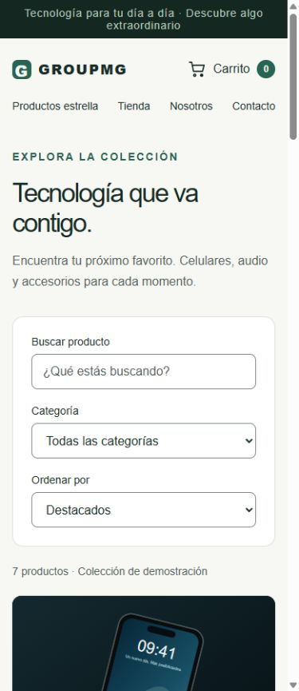
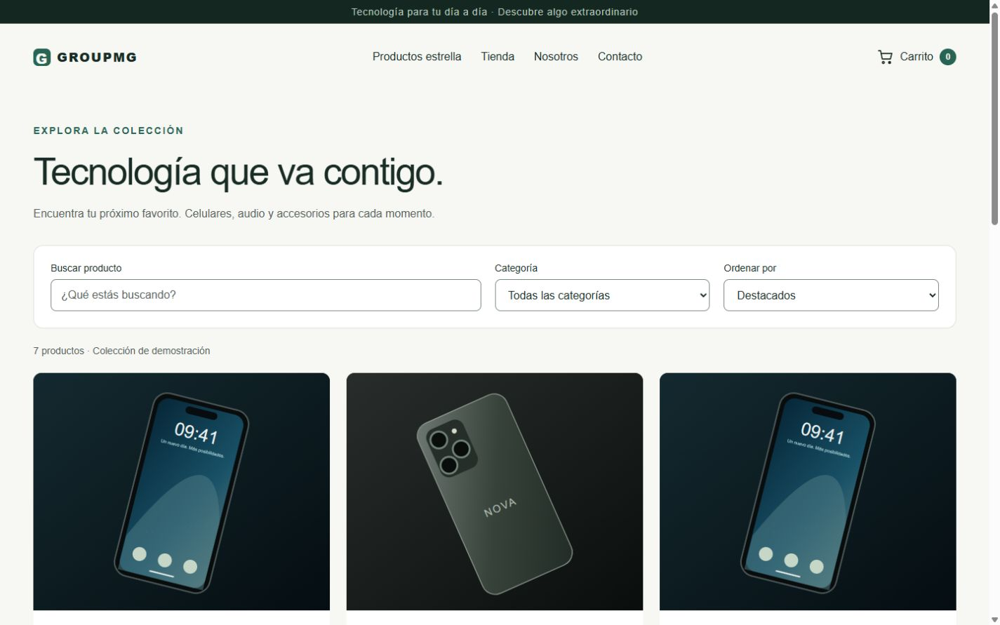

# Validación del frontend

Fecha: 2026-10-04. Navegador integrado de Codex, servidor de producción local temporal en puerto 3002. Datos ficticios y pago simulado.

## Cobertura responsive

Ocho rutas comprobadas con anchos de 360, 390, 768, 1440 y 1920 px, altura de 900 px:

- Inicio `/`.
- Catálogo `/catalogo`.
- Ficha disponible `/producto/MG-DEMO-001`.
- Ficha agotada `/producto/MG-DEMO-012`.
- Carrito `/carrito`.
- Checkout `/checkout`.
- Pago pendiente `/pago-pendiente`.
- Confirmación `/confirmacion`.

Las 40 comprobaciones finales de DOM no encontraron desbordamiento horizontal, imágenes cargadas con dimensiones naturales nulas ni inputs/selects sin etiqueta. Se revisaron capturas de inicio móvil, ficha, checkout, pago pendiente y catálogo; no representan una revisión visual exhaustiva de cada combinación. Pago pendiente y confirmación también se comprobaron con una orden demo en los cinco tamaños antes de los últimos ajustes de foco.

## Pruebas funcionales y de teclado

- Búsqueda sin resultados y recuperación al limpiar filtros: siete productos de nuevo y foco en el buscador.
- Tab del buscador al selector de categoría y Shift+Tab de regreso.
- Enlace «Saltar al contenido»: foco en el elemento principal.
- Carrusel: ArrowRight cambia de diapositiva 2 a 3 y mantiene disponible el encabezado principal.
- Agregar un producto mediante Enter; aumentar, reducir y eliminar cantidades. El contador refleja 1 → 2 → 1 → 0 y los importes cambian con las unidades.
- Eliminar un producto devuelve el foco al título del carrito, incluido el último producto.
- Carrito y checkout vacíos ofrecen enlaces para volver a comprar.
- Producto agotado: botón de compra deshabilitado.
- Checkout sin completar: validación nativa, ocho campos inválidos y foco en el primer campo requerido.
- Checkout completado con datos ficticios: navegación a pago pendiente; aprobación simulada mediante Enter y navegación a confirmación.
- Foco del buscador comprobado con contorno verde de 3 px.

## Correcciones realizadas

- Texto secundario global más oscuro: contraste sobre verde claro de 5,26:1.
- Token específico para bordes de Input y Select: contraste sobre blanco de 3,75:1.
- H1 persistente del Hero fuera de las diapositivas inactivas.
- Destino del enlace de salto enfocable.
- Retorno del foco al limpiar filtros y eliminar productos.

Las relaciones de contraste se calcularon con luminancia relativa sRGB sobre los colores sólidos correspondientes. No equivalen a una certificación completa de accesibilidad.

## Verificación técnica y límites

`pnpm build` pasó después de la última corrección, incluida la comprobación de TypeScript.

La prueba se realizó con tamaños de ventana simulados; faltan dispositivos físicos, Safari/Firefox y lector de pantalla. Se inspeccionó el soporte existente para movimiento reducido, sin emular esa preferencia. No se forzaron errores de almacenamiento ni errores de servidor en el navegador; las acciones de recuperación de esos casos requieren una prueba específica. La carga es transitoria y no se midió bajo red lenta. El flujo probado continúa siendo una demostración sin integración de pago real.

## Evidencia

